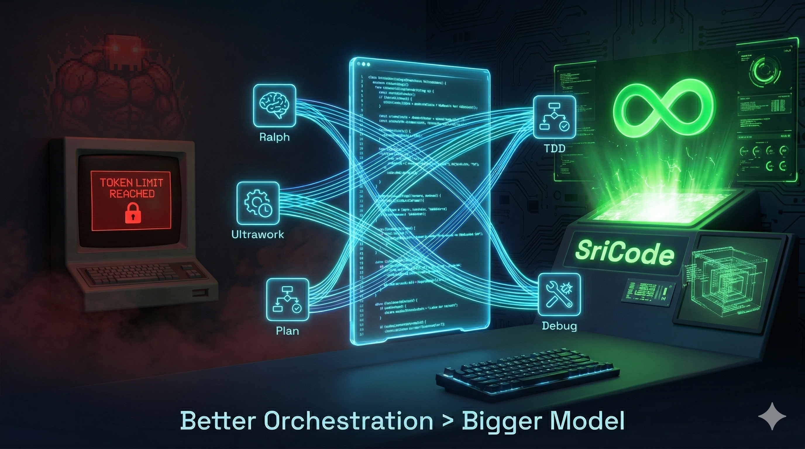

# sricode



Local AI coding agent for Sriram — powered by [Ollama](https://ollama.com) + [qwen3.5:14b](https://ollama.com/library/qwen3.5) + [OMC](https://github.com/Yeachan-Heo/oh-my-claudecode) skills.

## Why SriCode?

Claude Code is great — until it hits a token limit and pauses mid-task. SriCode **never stops**.

- **Zero token limits** — Ralph keeps running until the task is done
- **$0 cost** — Runs on your machine, no API bills
- **100% private** — Your code never leaves your laptop
- **OMC multi-agent orchestration** — A weaker model with better orchestration beats a stronger model running solo

## Prerequisites

- [Bun](https://bun.sh) 1.3+
- [Ollama](https://ollama.com) running locally with qwen3.5:14b pulled

```bash
ollama pull qwen3.5:14b
```

## Setup

```bash
# Clone and install
git clone https://github.com/sriram369/sricode.git
cd sricode
bun install

# Configure OMC hooks
bun run packages/omc/scripts/setup-settings.ts

# Run
./packages/opencode/bin/opencode
```

## Architecture

| Layer | Tech |
|-------|------|
| CLI | Fork of [opencode](https://github.com/sst/opencode) (MIT) |
| Model | qwen3.5:14b via Ollama (local, no API cost) |
| Skills | OMC multi-agent skills: brainstorm, plan, ralph, ultrawork, tdd... |
| Hooks | PreToolUse / PostToolUse / Stop hooks for OMC persistent mode |

## Upgrade model

When you get 32GB+ RAM, swap to the Claude-distilled 27B:

```bash
ollama pull Jackrong/Qwen3.5-27B-Claude-4.6-Opus-Reasoning-Distilled:Q4_K_M
```

Then update `SRICODE_MODEL` in your env.

## Skills available

All OMC skills work out of the box. Key ones:

| Skill | What it does |
|-------|-------------|
| `brainstorm` | Turn ideas into specs with collaborative dialogue |
| `plan` | Strategic planning with interview workflow |
| `ralph` | Persist until task is complete |
| `ultrawork` | Parallel execution for high-throughput tasks |
| `tdd` | Test-driven development enforcement |
| `systematic-debugging` | Evidence-driven bug investigation |
